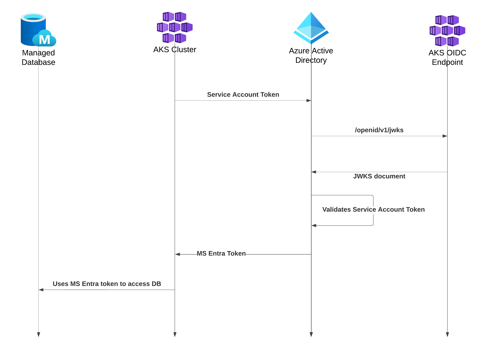

# Using Workload Identities in Azure Kubernetes Service
### Introduction
#### What is a Workload Identity?
Microsoft Entra Workload Identity is a technology that allows AKS pods to use Azure Identity for authorization against other Azure resources. Using it greatly improves security as it enables your applications to use Azure RBAC instead of connection strings. This allows for more fine-grained control and reduces the number of credentials you need to store securely and reliably. 
#### Managed Identities in Azure
Managed Identity is a resource in Azure  that provides an identity for your applications to use for connecting to other services without the need to handle any secrets, connection strings or certificates yourself. You can use them to authenticate to any resource or application that support MS Entra authentication, including your own applications. There are System and User-assigned Managed Identities. System-assigned Managed Identities provide less granular access control -- for example, if your AKS runs more than one pod, you can't give them different permissions. User-assigned Managed Identities allow for far more granular control because you can have a separate identity for every pod with exact permissions it needs.

| Property             | User-assigned managed identity   | System-assigned managed identity        |
| -------------------- | -------------------------------- | --------------------------------------- |
| **Lifecycle**        | Independent lifecycle            | Same as the resource it was created for |
| **Identity Scope**   | Defined by the user              | Single Azure resource                   |
| **Reusability**      | Can be used by multiple services | Limited to one resource                 |
| **Setup complexity** | Low                              | Moderate                                |
#### How it works?
Workload Identity maps Kubernetes Service Account to a User-assigned Managed Identity in Azure and closely integrates with RBAC. You simply create Role Assignments for your identity in Azure and your application uses them to access other resources. This setup allows Kubernetes pods to have specific permissions in Azure without the need to directly manage any credentials. 
Pods use their Kubernetes service accounts to request access tokens using OIDC federation. Pod's service account token is used to authenticate with Azure AD. Azure AD validates the OIDC token and issues an access token for the managed identity associated with the service account, granting access to Azure resources.

### API to be deployed
In this tutorial we will be deploying a simple Python API built using FastAPI with three endpoints:
- `GET /service`
    Returns hardcoded `{"service-name": "cats-api"}`. This endpoint exists for simple checks if the app is running.
- `GET "/cat/{user}"`
    Returns signed URL for a picture of user's cat
- `POST "/cat/{user}"`
    You can use this endpoint to upload new user's cat picture. This will store new blob named 'cat' in `cats` container under `{User}` path.
    For example, `POST /cat/Davyd` will save your upload to `cats` container at `Davyd/cat`.
You can find all code for the API and PowerShell script used to setup AKS in [my repository](https://github.com/davydrudenkoua/k8s-workload-identity)
#### Using Workload Identity in your code
Remember that point about not having to manage any credentials or connection strings in code? It sounded like magic to me, but here is how it looks in code:
```python
from azure.identity import DefaultAzureCredential
from azure.storage.blob import BlobServiceClient

class CatPicsStorageService:
    def __init__(self):
        self.container_name = "cats"
        self.account_name = "davydscats"

        self.blob_service_client = BlobServiceClient(
            account_url=f"https://{self.account_name}.blob.core.windows.net",
            credential=DefaultAzureCredential()
        )
```
Simple, right?
### Setting up you AKS cluster to use Workload Identities
In this tutorial we will setup a new AKS cluster for use with Workload Identities. It will have one pod running a simple Python FastAPI server deployed from a private Docker Hub registry that will create signed URLs to access files in Blob Storage. For this it will need `Blob Storage Contributor` role in that storage account. You can find all source code in my [GitHub repository](https://github.com/davydrudenkoua/k8s-workload-identity).
#### Prerequisites
-  Azure Subscription
-  Storage Account
-  Azure CLI >= 2.47.0
-  aks-preview Azure CLI extension >= 9.0.0b7
#### Declaring necessary variables
Firstly, we need to declare variables with names and location for the resources we are going to create:
```powershell
    $ResourceGroup = "k8s-to-blobstorage"
    $Location = "polandcentral"
    $ClusterName = "cats-api-k8s"
    $ServiceAccountNamespace = "default"
    $ServiceAccountName="cats-api-sa"
    $SubscriptionId = $(az account show --query "id" --output tsv)
    $UserAssignedIdentityName="CatsApiUserAssignedIdentity"
    $FederatedIdentityCredentialName="CatsApiFederatedIdentity"
```
#### Creating User-assigned Managed Identity
This is the identity our application will use to access Azure Storage Account.

```powershell
    az identity create `
        --name $UserAssignedIdentityName `
        --resource-group $ResourceGroup `
        --location $Location `
        --subscription $SubscriptionId
```
#### Creating "Storage Blob Data Contributor" Role Assignment
Because our application can upload blobs and generate SAS tokens for them, we need to setup access to Storage Account.
```powershell
# Getting User-assigned Managed Identity Id
    $IdentityPrincipalId = $(
        az identity show `
            --name $UserAssignedIdentityName `
            --resource-group $ResourceGroup `
            --query "principalId" `
            --output tsv
    )

# Locating Storage Account Id
    $StorageAccountId = $(
        az storage account show `
            --resource-group $ResourceGroup `
            --name "davydscats" `
            --query "id" `
            --output tsv
    )
# Creating Azure Role Assignment
    az role assignment create `
        --assignee-object-id $IdentityPrincipalId `
        --role "Storage Blob Data Contributor" `
        --scope $StorageAccountId `
        --assignee-principal-type "ServicePrincipal"
```
#### Creating AKS with Workload Identity and OIDC Issuer support
Create AKS cluster with the necessary features enabled using this command:
```powershell
# Creating AKS Cluster with one VM
    az aks create `
        --resource-group $ResourceGroup `
        --name $ClusterName `
        --enable-oidc-issuer `
        --enable-workload-identity `
        --generate-ssh-keys `
        --location $Location `
        --node-vm-size "Standard_B2s" `
        --node-count 1 `
        --tier "free" `
        --load-balancer-sku basic
# Logging in to the new cluster	
    az aks get-credentials --name $ClusterName --resource-group $ResourceGroup
        
```
ℹ️ If you do not have aks-preview or it is and older version, you might get an error similar to this:
```
cli.azure.cli.core.azclierror: unrecognized arguments: --tier standard
az_command_data_logger: unrecognized arguments: --tier standard
```
To check your aks-preview extension version, you can run  `az extension show --name aks-preview --query version`. 
#### Creating Kubernetes secret to pull image from Docker Hub
Because the image is hosted privately, you will need to create a Kubernetes secret for it to be able to pull it when creating a deployment. I'm using environment variables not to put sensitive data in the script, but in production you can keep those values in KeyVault and access it from CI/CD environment. You can find information on how to create Docker PAT on [this page](https://docs.docker.com/security/for-developers/access-tokens/).
```powershell
    kubectl create secret docker-registry cats-api-registry-secret `
        --docker-server=https://index.docker.io/v1/ `
        --docker-username=$Env:DOCKER_USERNAME `
        --docker-password=$Env:DOCKER_PASSWORD
```

#### Creating Kubernetes Service Account 
For our pod to be able to use Workload Identity, we need to create a Kubernetes Service Account for it. To do this, create a new file named `cats-api.serviceAccount.yaml` and add the following code:

```yaml
apiVersion: v1
kind: ServiceAccount
metadata:
  annotations:
    azure.workload.identity/client-id: {{USER_ASSIGNED_CLIENT_ID}}
  name: {{SERVICE_ACCOUNT_NAME}}
  namespace: {{SERVICE_ACCOUNT_NAMESPACE}}
```

You can ignore the variables in double curly brackets and just type values in. These will be replaced by actual values from PowerShell variables later.
You apply the template using this command:
```powershell
    $ServiceAccountTemplate = Get-Content -Path "cats-api.serviceAccount.yaml" -Raw
    $ServiceAccountTemplate = $ServiceAccountTemplate -replace "{{USER_ASSIGNED_CLIENT_ID}}", $UserAssignedClientId
    $ServiceAccountTemplate = $ServiceAccountTemplate -replace "{{SERVICE_ACCOUNT_NAME}}", $ServiceAccountName
    $ServiceAccountTemplate = $ServiceAccountTemplate -replace "{{SERVICE_ACCOUNT_NAMESPACE}}", $ServiceAccountNamespace
    Write-Host "Service account template to be applied:`n$ServiceAccountTemplate"
    $ServiceAccountTemplate | kubectl apply -f -
```
#### Creating Federated Credential
For the mapping between Kubernetes Service Account and Managed Identity to work you need to create a Federated Identity Credential. You can find more information on Federated Credentials [here](https://learn.microsoft.com/en-us/graph/api/resources/federatedidentitycredentials-overview?view=graph-rest-1.0).
```powershell
az identity federated-credential create `
        --name $FederatedIdentityCredentialName `
        --identity-name $UserAssignedIdentityName `
        --resource-group $ResourceGroup `
        --issuer $AksOidcIssuer `
        --subject "system:serviceaccount:${ServiceAccountNamespace}:${ServiceAccountName}" `
        --audience "api://AzureADTokenExchange"
```
#### Creating API Deployment
Finally, we can create a Deployment and a Service for our API. Service is required for our API to be accessible from the public Internet because AKS cluster does not have a public IP by default.
Create new file `cats-api.deployment.yaml` and add the following code:
```yaml
apiVersion: apps/v1
kind: Deployment
metadata:
  name: cats-api-deployment
  labels:
    app: cats-api
spec:
  replicas: 1
  selector:
    matchLabels:
      app: cats-api
  template:
    metadata:
      labels:
        app:  cats-api
        azure.workload.identity/use: "true"
    spec:
      serviceAccountName: {{SERVICE_ACCOUNT_NAME}}
      containers:
      - name:  cats-api
        image:  davydrudenkoua/cats-api:latest
        resources:
          requests:
            cpu: 100m
            memory: 100Mi
          limits:
            cpu: 100m
            memory: 100Mi
      imagePullSecrets:
        - name: cats-api-registry-secret
---
apiVersion: v1
kind: Service
metadata:
  name: cats-api-loadbalancer
  labels:
    app: cats-api
spec:
  selector:
    app: cats-api
  type: LoadBalancer
  ports:
  - name: cats-api
    protocol: TCP
    port: 8080
    targetPort: 80
```
To apply it, run 
```powershell
$DeploymentTemplate = Get-Content -Path "cats-api.deployment.yaml" -Raw
$DeploymentTemplate = $DeploymentTemplate -replace "{{SERVICE_ACCOUNT_NAME}}", $ServiceAccountName
$DeploymentTemplate | kubectl apply -f -
```
ℹ️ You probably won't have access to this Docker image as it is published in a private registry. To run your own image, replace `spec.template.spec.containers.image` with your image and create secret accordingly.
That's it, your API should be up and able to access files in your Storage Account!